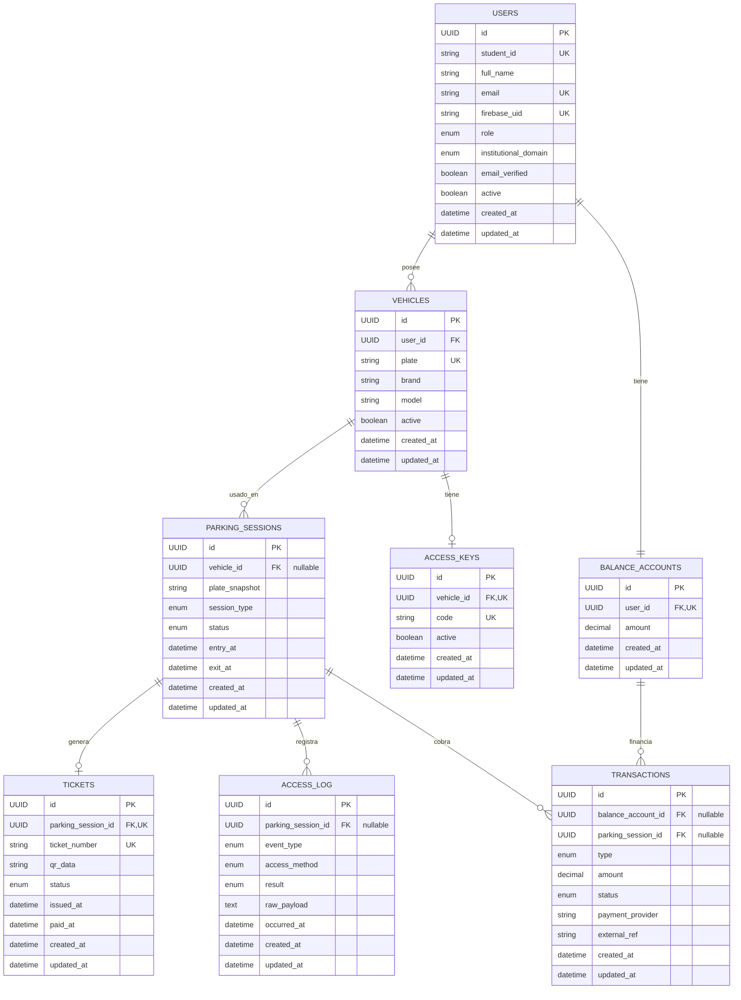

# DER - parko-persistence-core

Diagrama entidad-relación generado a partir de las clases `*Entity` en `com.parko.persistence.core.model.entity`.

## Notas

- `parking_session_id` en `TRANSACTIONS` y `ACCESS_LOG` es nullable: no toda transacción o log de acceso está atado a una sesión activa.
- `ACCESS_KEYS.vehicle_id` y `BALANCE_ACCOUNTS.user_id` son unique (relación 1:1 real aunque mapeadas como `@ManyToOne`/`@OneToOne`).
